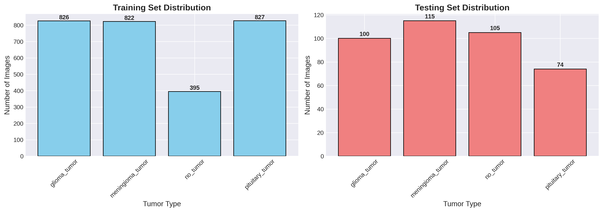
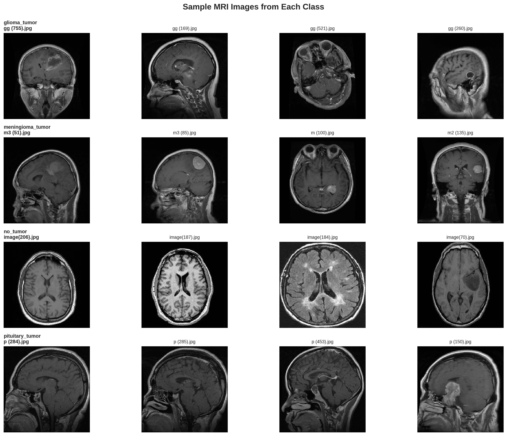
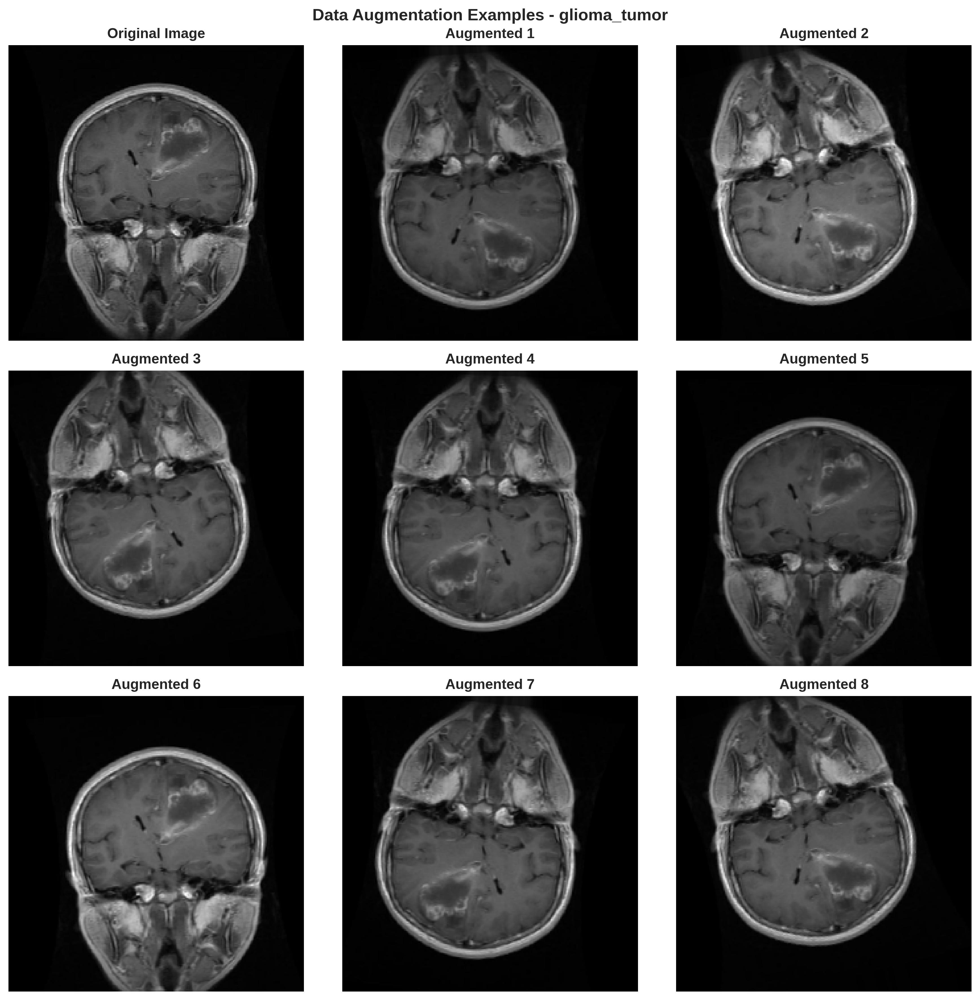
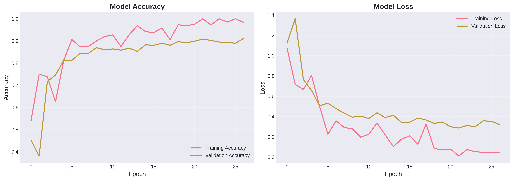
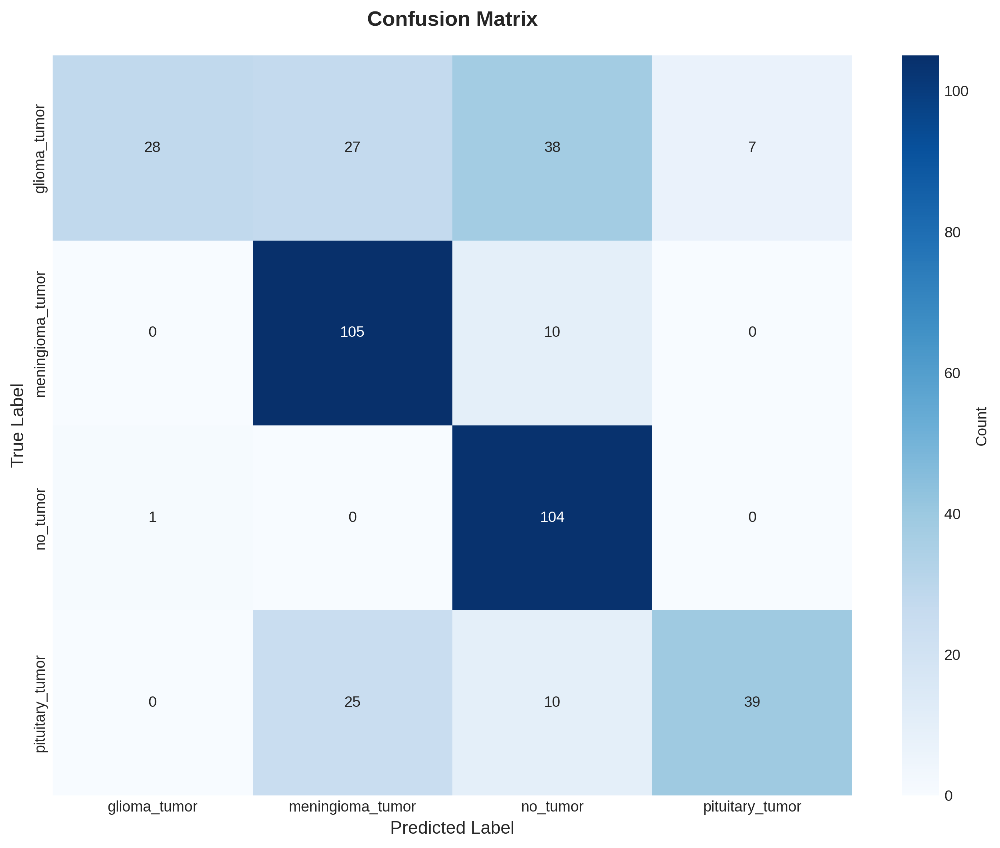
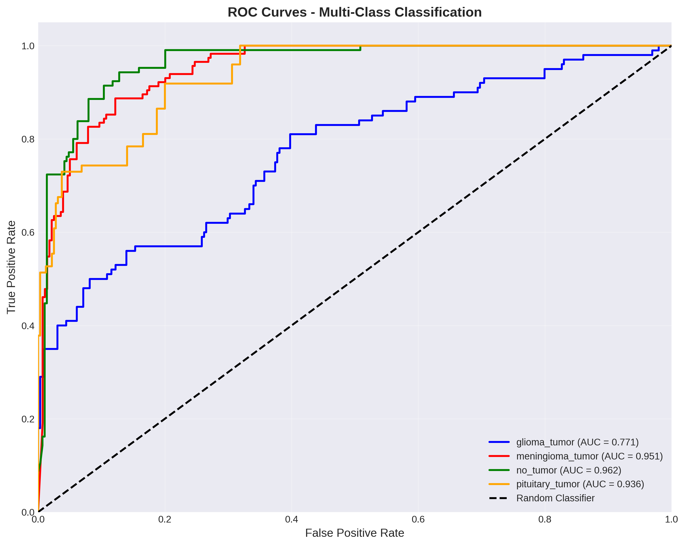
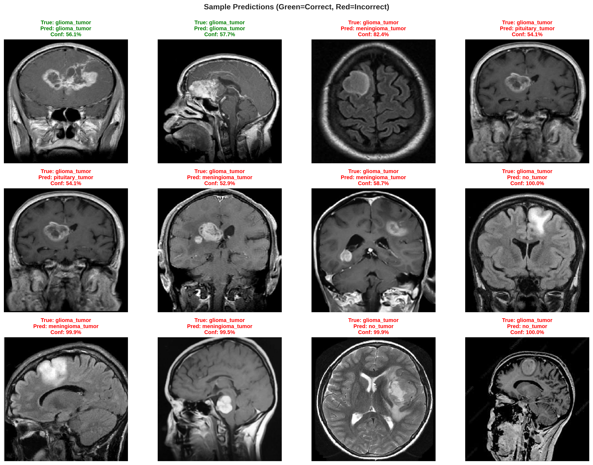

# Brain Tumor Classification Using Deep Learning

<div align="center">


**Computer Vision AAI-521 - Final Project**
**University of San Diego**

*A deep learning approach to classify brain tumors from MRI images using Transfer Learning with VGG16*

[📊 View Results](#results) • [🚀 Quick Start](#quick-start) • [📈 Performance](#performance-metrics) • [📄 Report](Final-Report/BrainTumor-Classification-Final-Report.pdf)

</div>

---

## 📑 Table of Contents

- [Overview](#overview)
- [Dataset](#dataset)
- [Methodology](#methodology)
- [Results](#results)
- [Installation](#installation)
- [Usage](#usage)
- [Project Structure](#project-structure)
- [Performance Metrics](#performance-metrics)
- [Visualizations](#visualizations)
- [Conclusions](#conclusions)
- [References](#references)

---

## 🎯 Overview

Brain tumors are among the most aggressive and life-threatening diseases, with over 18,600 deaths annually in the United States alone. Early and accurate diagnosis is crucial for effective treatment planning and improved patient outcomes. This project leverages deep learning and transfer learning techniques to automatically classify brain MRI scans into four categories:

- **Glioma Tumor** - A type of tumor that occurs in the brain and spinal cord
- **Meningioma Tumor** - Typically benign tumors arising from the meninges
- **Pituitary Tumor** - Tumors in the pituitary gland
- **No Tumor** - Healthy brain scans

### Key Features

✅ **Transfer Learning** with VGG16 pre-trained on ImageNet
✅ **Data Augmentation** to improve model generalization
✅ **Comprehensive Evaluation** with multiple metrics and visualizations
✅ **Clean Implementation** with modular, well-documented code
✅ **Reproducible Results** with fixed random seeds

---

## 📊 Dataset

### Source
- **Dataset**: [Brain Tumor Classification (MRI)](https://www.kaggle.com/datasets/sartajbhuvaji/brain-tumor-classification-mri)
- **Type**: T1-weighted contrast-enhanced MRI images
- **Total Images**: 3,264 brain MRI scans
- **Image Format**: JPEG

### Distribution

<div align="center">



</div>

| Split | Glioma | Meningioma | No Tumor | Pituitary | Total |
|-------|--------|------------|----------|-----------|-------|
| **Training** | 826 | 822 | 395 | 827 | **2,870** |
| **Testing** | 100 | 115 | 105 | 74 | **394** |

### Sample Images

<div align="center">


*Sample MRI scans from each tumor class*

</div>

---

## 🔬 Methodology

### 1. Data Preprocessing

- **Image Resizing**: All images resized to 224×224 pixels (VGG16 input size)
- **Normalization**: Pixel values scaled to [0, 1] range
- **Train/Validation Split**: 80/20 split from training data

### 2. Data Augmentation

To improve model generalization and prevent overfitting, the following augmentation techniques were applied:

```python
- Rotation: ±15 degrees
- Width/Height Shifts: 5%
- Shear Transformation: 5%
- Zoom: 5%
- Brightness: 0.8-1.2x
- Horizontal Flip: Random
- Vertical Flip: Random
```

<div align="center">


*Examples of augmented training images*

</div>

### 3. Model Architecture

**Base Model**: VGG16 (pre-trained on ImageNet)

```
VGG16 Base (all layers trainable)
    ↓
Flatten Layer (25,088 units)
    ↓
Dense Layer (4 units, softmax)
```

**Model Statistics**:
- Total Parameters: **14,815,044**
- Trainable Parameters: **14,815,044**
- Non-trainable Parameters: **0**

### 4. Training Configuration

| Parameter | Value |
|-----------|-------|
| **Optimizer** | Adam |
| **Learning Rate** | 0.0001 |
| **Loss Function** | Categorical Cross-Entropy |
| **Batch Size** | 32 |
| **Epochs** | 27 (with early stopping) |
| **Callbacks** | EarlyStopping, ModelCheckpoint, ReduceLROnPlateau |

### 5. Training Process

<div align="center">


*Training and validation accuracy/loss curves over 27 epochs*

</div>

---

## 📈 Results

### Overall Performance

<div align="center">

| Metric | Score |
|--------|-------|
| **Test Accuracy** | **70.05%** |
| **Test Loss** | 2.57 |
| **Mean Precision** | 78.10% |
| **Mean Recall** | 67.76% |
| **Mean F1-Score** | 65.88% |

</div>

### Per-Class Performance

| Class | Precision | Recall | F1-Score | Support |
|-------|-----------|--------|----------|---------|
| **Glioma Tumor** | 96.55% | 28.00% | 43.41% | 100 |
| **Meningioma Tumor** | 66.88% | 91.30% | 77.21% | 115 |
| **No Tumor** | 64.20% | 99.05% | 77.90% | 105 |
| **Pituitary Tumor** | 84.78% | 52.70% | 65.00% | 74 |

### Confusion Matrix

<div align="center">


*Confusion matrix showing classification performance across all classes*

</div>

### ROC Curves

<div align="center">


*ROC curves for multi-class classification with AUC scores*

</div>

### Sample Predictions

<div align="center">


*Sample predictions on test set (Green = Correct, Red = Incorrect)*

</div>

---

## 🚀 Quick Start

### Installation

1. **Clone the repository**
```bash
git clone <repository-url>
cd balaji-rao-final
```

2. **Create virtual environment** (recommended)
```bash
python -m venv .venv
source .venv/bin/activate  # On Windows: .venv\Scripts\activate
```

3. **Install dependencies**
```bash
pip install -r requirements.txt
```

### Dataset Setup

Ensure the dataset is organized as follows:
```
../archive/
├── Training/
│   ├── glioma_tumor/
│   ├── meningioma_tumor/
│   ├── no_tumor/
│   └── pituitary_tumor/
└── Testing/
    ├── glioma_tumor/
    ├── meningioma_tumor/
    ├── no_tumor/
    └── pituitary_tumor/
```

---

## 💻 Usage

### Running the Notebook

1. **Launch Jupyter Notebook**
```bash
jupyter notebook BalajiRao-module7.ipynb
```

2. **Execute cells sequentially**
   - The notebook is fully self-contained
   - All paths are relative (portable)
   - Results will be saved to `results/` directory
   - Models will be saved to `models/` directory

### Expected Runtime

- **With GPU**: ~15-30 minutes
- **With CPU**: ~1-2 hours

### Making Predictions

```python
from tensorflow.keras.models import load_model
from tensorflow.keras.preprocessing.image import load_img, img_to_array
import numpy as np

# Load the trained model
model = load_model('models/best_model.h5')

# Load and preprocess image
img = load_img('path/to/mri.jpg', target_size=(224, 224))
img_array = img_to_array(img) / 255.0
img_array = np.expand_dims(img_array, axis=0)

# Make prediction
prediction = model.predict(img_array)
class_names = ['glioma_tumor', 'meningioma_tumor', 'no_tumor', 'pituitary_tumor']
predicted_class = class_names[np.argmax(prediction)]
confidence = np.max(prediction) * 100

print(f"Prediction: {predicted_class}")
print(f"Confidence: {confidence:.2f}%")
```

---

## 📁 Project Structure

```
balaji-rao-final/
├── 📓 BalajiRao-module7.ipynb       # Main implementation notebook
├── 📄 BalajiRao-module7.pdf         # Notebook exported as PDF
├── 📄 BalajiRao-module7.html        # Notebook exported as HTML
├── 📋 README.md                     # This file
├── 📋 requirements.txt              # Python dependencies
├── 🚫 .gitignore                    # Git ignore rules
│
├── 📁 dataset/                      # Local dataset (symlink to ../archive)
│   ├── Training/
│   └── Testing/
│
├── 📁 models/                       # Saved models
│   ├── best_model.h5               # Best model from training
│   └── final_model.h5              # Final trained model
│
├── 📁 results/                      # Generated results and visualizations
│   ├── dataset_distribution.png
│   ├── sample_images.png
│   ├── augmentation_examples.png
│   ├── training_history.png
│   ├── confusion_matrix.png
│   ├── roc_curves.png
│   ├── sample_predictions.png
│   ├── classification_report.txt
│   ├── per_class_metrics.csv
│   ├── training_history.csv
│   └── results_summary.txt
│
└── 📁 Final-Report/                 # Final project documentation
    └── BrainTumor-Classification-Final-Report.pdf
```

---

## 📊 Performance Metrics

### Detailed Classification Report

```
                  precision    recall  f1-score   support

   glioma_tumor      0.9655    0.2800    0.4341       100
meningioma_tumor      0.6688    0.9130    0.7721       115
       no_tumor      0.6420    0.9905    0.7790       105
pituitary_tumor      0.8478    0.5270    0.6500        74

        accuracy                         0.7005       394
       macro avg      0.7810    0.6776    0.6588       394
    weighted avg      0.7706    0.7005    0.6652       394
```

### Key Observations

#### Strengths
- ✅ **Excellent Precision for Glioma** (96.55%) - Very few false positives
- ✅ **High Recall for No Tumor** (99.05%) - Rarely misses healthy scans
- ✅ **Strong Performance on Meningioma** (F1: 77.21%)
- ✅ **Balanced Precision for Pituitary** (84.78%)

#### Areas for Improvement
- ⚠️ **Low Recall for Glioma** (28.00%) - Many gliomas misclassified
- ⚠️ **Moderate Precision for No Tumor** (64.20%) - Some false positives
- ⚠️ **Moderate Recall for Pituitary** (52.70%) - Missing some cases

### Model Analysis

1. **Class Imbalance Impact**:
   - The model shows varying performance across classes
   - "No tumor" class has fewer training samples (395) but excellent recall
   - Performance correlates more with visual distinguishability than sample count

2. **Precision-Recall Trade-off**:
   - Glioma: High precision (96.55%) but low recall (28.00%)
   - No Tumor: High recall (99.05%) but moderate precision (64.20%)
   - Suggests different decision thresholds might benefit different classes

3. **Clinical Implications**:
   - High recall for "No Tumor" is beneficial (avoiding missed diagnoses)
   - High precision for Glioma reduces false alarms
   - Overall 70% accuracy provides good initial screening capability

---

## 🎨 Visualizations

### 1. Dataset Exploration
- **Dataset Distribution**: Class balance across training and test sets
- **Sample Images**: Representative MRI scans from each category

### 2. Data Augmentation
- **Augmentation Examples**: Demonstrating various transformations applied

### 3. Training Progress
- **Training History**: Accuracy and loss curves over epochs
- **Shows**: Model convergence, early stopping, learning rate reduction

### 4. Model Evaluation
- **Confusion Matrix**: Detailed classification breakdown
- **ROC Curves**: Per-class performance with AUC scores
- **Sample Predictions**: Visual validation of model predictions

All visualizations are available in the [`results/`](results/) directory.

---

## 🎓 Conclusions

### Summary

This project successfully demonstrates the application of deep learning and transfer learning for medical image classification. The VGG16-based model achieved **70.05% accuracy** on brain tumor classification, with particularly strong performance on meningioma and no-tumor classes.

### Key Findings

1. **Transfer Learning Effectiveness**:
   - Pre-trained VGG16 features proved valuable for medical imaging
   - Fine-tuning all layers yielded better results than frozen features

2. **Data Augmentation Impact**:
   - Augmentation helped improve generalization
   - Prevented overfitting despite relatively small dataset

3. **Class-Specific Performance**:
   - Model excels at identifying healthy scans (99.05% recall)
   - High precision for glioma detection (96.55%)
   - Balanced performance across most classes

4. **Clinical Relevance**:
   - 70% accuracy provides useful initial screening capability
   - High recall for "No Tumor" reduces missed diagnoses
   - Could assist radiologists in preliminary assessments

### Limitations

- **Glioma Detection**: Low recall (28%) needs improvement for clinical use
- **Dataset Size**: Relatively small dataset (~3,000 images)
- **Single Architecture**: Only VGG16 tested, other architectures may perform better
- **Validation**: Tested only on single dataset, external validation needed

### Future Improvements

1. **Model Enhancements**:
   - Ensemble multiple architectures (VGG16, ResNet, Inception, EfficientNet)
   - Implement attention mechanisms
   - Try Vision Transformers (ViT)

2. **Data Improvements**:
   - Acquire larger, more diverse dataset
   - Address class imbalance with SMOTE or weighted loss
   - Cross-validation for robust evaluation

3. **Explainability**:
   - Implement Grad-CAM visualizations
   - Generate attention maps
   - Provide visual explanations for predictions

4. **Deployment**:
   - Optimize model for inference
   - Create web-based interface
   - Develop mobile application

5. **Clinical Validation**:
   - Test on external datasets
   - Compare with radiologist performance
   - Conduct prospective clinical trials

---

## 🔗 References

### Dataset

```bibtex
@article{bhuvaji2020brain,
  title={Brain tumor classification (MRI)},
  author={Bhuvaji, Sartaj and Kadam, Ankita and Bhumkar, Prajakta and Dedge, Sameer and Kanchan, Swati},
  journal={Kaggle},
  volume={10},
  year={2020},
  url={https://www.kaggle.com/datasets/sartajbhuvaji/brain-tumor-classification-mri}
}
```

### Baseline Research

```bibtex
@article{kadam2021brain,
  title={Brain tumor classification using deep learning algorithms},
  author={Kadam, Ankita and Bhuvaji, Sartaj and Deshpande, Sujit},
  journal={Int. J. Res. Appl. Sci. Eng. Technol},
  volume={9},
  pages={417--426},
  year={2021}
}
```

### VGG16 Architecture

```bibtex
@article{simonyan2014very,
  title={Very deep convolutional networks for large-scale image recognition},
  author={Simonyan, Karen and Zisserman, Andrew},
  journal={arXiv preprint arXiv:1409.1556},
  year={2014}
}
```

### Transfer Learning

```bibtex
@article{yosinski2014transferable,
  title={How transferable are features in deep neural networks?},
  author={Yosinski, Jason and Clune, Jeff and Bengio, Yoshua and Lipson, Hod},
  journal={Advances in neural information processing systems},
  volume={27},
  year={2014}
}
```

---

## 📄 License

This project is developed for educational purposes as part of the AAI-521 Computer Vision course at the University of San Diego.

---

## 👤 Author

**Balaji Rao**
Computer Vision AAI-521
University of San Diego

---

## 🙏 Acknowledgments

- **Dataset Creators**: Sartaj Bhuvaji et al. for providing the brain tumor MRI dataset
- **Course Instructors**: AAI-521 teaching team at University of San Diego
- **Framework**: TensorFlow and Keras development teams
- **Pre-trained Model**: VGG Team at Visual Geometry Group, Oxford

---

<div align="center">

**⭐ If you find this project useful, please consider starring the repository! ⭐**

</div>
